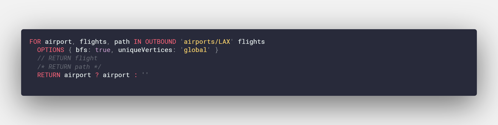
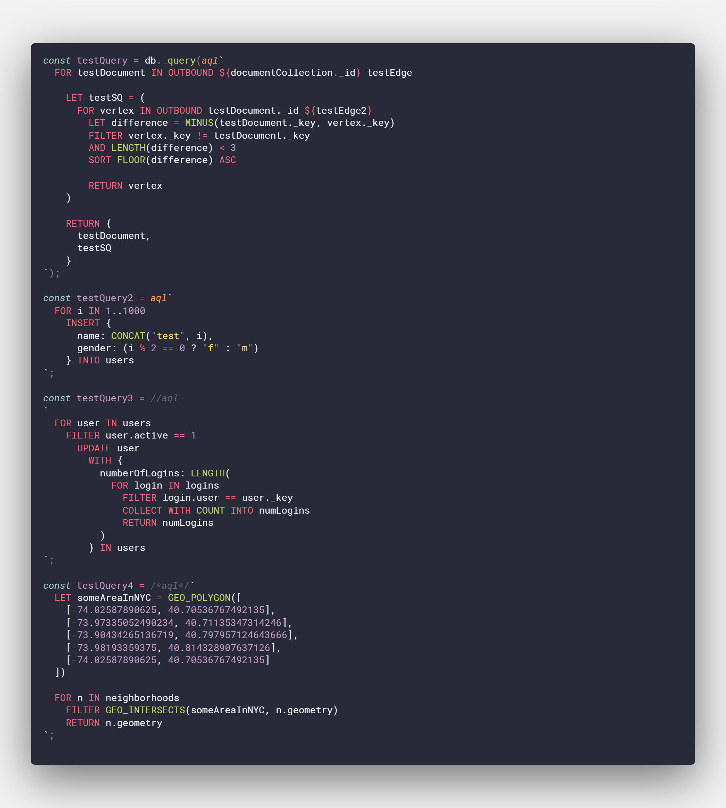

# Syntax Highlighting for ArangoDB Query Language (AQL)

Provides basic syntax highlighting for AQL. This repository was originally inspired and bootstrapped from clintwood's [arango-aql-query](https://github.com/clintwood/arango-aql-query) for Atom Editor and has also taken approaches and formatting from ronsoak's [vsc_redshift_extension](https://github.com/ronsoak/vsc_redshift_extension). ronsoak's [article](https://dev.to/ronsoak/i-built-my-own-vs-code-syntax-highlighter-from-scratch-and-here-s-what-i-learned-1h98) on building a syntax highlighter is also a pleasant read if you are interested in making one for your favorite language.

The highlighter comes with syntax highlighting for template literals to support Foxx and [arangojs](https://github.com/arangodb/arangojs)

## Current Highlighting Support

Currently lacks a ternary operator, parenthesis, array, and object wrapping (which is a regex nightmare) and is planned in the next release, but should work well without it. If anyone wants to create a pull request to handle them, that would be sincerely appreciated.

Keyword highlighting has been taken from [ArangoDB's frontend highlighter](https://raw.githubusercontent.com/arangodb/arangodb/master/js/apps/system/_admin/aardvark/APP/frontend/src/mode-aql.js).

Function highlighting is taken from `http://localhost:8529/_db/_system/_api/aql-builtin` and is extracted in raw JSON and processed by name in the data folder.

### Keywords

Patterns matched to keyword.control:

> FOR, RETURN, FILTER, SEARCH, SORT, LIMIT, LET, COLLECT, ASC, DESC, IN, INTO, INSERT, UPDATE, REMOVE, REPLACE, UPSERT, OPTIONS, WITH, AND, OR, NOT, DISTINCT, GRAPH, SHORTEST_PATH, OUTBOUND, INBOUND, ANY, ALL, NONE, AGGREGATE, LIKE, K_SHORTEST_PATHS, PRUNE

### Functions
Patterns matched to support.functions:

> BM25, TFIDF, BOOST, IN_RANGE, PHRASE, STARTS_WITH, TOKENS, WITHIN_RECTANGLE, WITHIN, WARN, PREGEL_RESULT, COLLECTION_COUNT, CHECK_DOCUMENT, CURRENT_DATABASE, CURRENT_USER, VERSION, V8, DECODE_REV, IS_SAME_COLLECTION, PARSE_IDENTIFIER, FIRST_DOCUMENT, INTERSECTION, RADIANS, UNION, DATE_MINUTE, ATAN, FULLTEXT, ATAN2, COS, EXP, GEO_MULTILINESTRING, LOG2, SQRT, GEO_INTERSECTS, FLOOR, RIGHT, COLLECTIONS, COUNT, ABS, UUID, ENCODE_URI_COMPONENT, DATE_MONTH, ANALYZER, TO_HEX, POW, CONTAINS, SHA1, IS_DOCUMENT, SUBSTITUTE, FIRST, VALUES, PI, CONCAT, REMOVE_VALUE, OUTERSECTION, STDDEV, SHA512, UNION_DISTINCT, LEVENSHTEIN_DISTANCE, ASSERT, TRANSLATE, IS_KEY, RAND, SLICE, LOG10, HAS, FAIL, IS_BOOL, IS_NULL, CHAR_LENGTH, ASIN, TO_LIST, CEIL, ATTRIBUTES, TO_ARRAY, LEFT, SORTED_UNIQUE, MATCHES, TAN, NEAR, TO_BASE64, REMOVE_VALUES, IS_NUMBER, REGEX_MATCHES, LAST, IS_STRING, TYPENAME, KEEP, NOOPT, DATE_YEAR, IS_LIST, NOEVAL, DATE_ISO8601, FIND_LAST, SPLIT, DISTANCE, LOWER, DOCUMENT, REGEX_TEST, UNSHIFT, AVG, REGEX_SPLIT, LOG, IS_IN_POLYGON, DEGREES, TO_NUMBER, REGEX_REPLACE, IS_OBJECT, HASH, EXP2, GEO_LINESTRING, TRIM, DATE_ADD, TO_STRING, LTRIM, DATE_NOW, RANDOM_TOKEN, SLEEP, ACOS, CRC32, IS_ARRAY, FIND_FIRST, FLATTEN, UNSET_RECURSIVE, MERGE_RECURSIVE, ROUND, LENGTH, TO_BOOL, SORTED, SOUNDEX, GEO_MULTIPOLYGON, MIN, SIN, SUBSTRING, MAX, SUM, COUNT_UNIQUE, MEDIAN, DATE_HOUR, NOT_NULL, PERCENTILE, AVERAGE, VARIANCE_SAMPLE, VARIANCE_POPULATION, VARIANCE, COUNT_DISTINCT, PASSTHRU, RANGE, REVERSE, GEO_DISTANCE, RTRIM, NTH, MIN_MATCH, POSITION, JSON_STRINGIFY, CONTAINS_ARRAY, STDDEV_SAMPLE, APPEND, FIRST_LIST, POP, REMOVE_NTH, CALL, FNV64, CONCAT_SEPARATOR, APPLY, MERGE, DATE_DAY, UNSET, EXISTS, MINUS, JSON_PARSE, GEO_CONTAINS, GEO_EQUALS, DATE_QUARTER, STDDEV_POPULATION, UPPER, GEO_AREA, MD5, GEO_POINT, SHIFT, GEO_MULTIPOINT, GEO_POLYGON, DATE_TIMESTAMP, IS_DATESTRING, UNIQUE, DATE_DAYOFWEEK, ZIP, DATE_SECOND, DATE_DAYOFYEAR, DATE_MILLISECOND, DATE_ISOWEEK, PUSH, DATE_LEAPYEAR, LIKE, DATE_DAYS_IN_MONTH, DATE_SUBTRACT, DATE_DIFF, DATE_COMPARE, KEYS, DATE_FORMAT, DATE_TRUNC

### Comments

Pattern matched to comment.single:

> Any line starting with a double forward-slash //

Pattern matched to comment.block:

> Any block starting with a forward-slash and an asterisk /* ending with an asterisk and forward-slash */

### Strings

Patterns matched to string.quoted:

> Any string that is encapsulated by single ('), double ("), or template literal (`) quotes

### Numbers

Pattern matched to constant.numeric:

> Any decimal number

### Constants

Pattern matched to constant.language:

> Any boolean values (true, false) + null operator

Pattern matched to keyword.operator:

> Any non-word comparison or arithmetic operator (except ternary) available at [https://www.arangodb.com/docs/stable/aql/operators.html](https://www.arangodb.com/docs/stable/aql/operators.html)

## Roadmap

- [x] Ternary Operator
- [x] Parenthesis, Array, and Object wrapping (with expressions)
- [ ] Variables (from @, LET, and RETURN)
